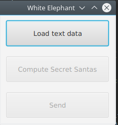
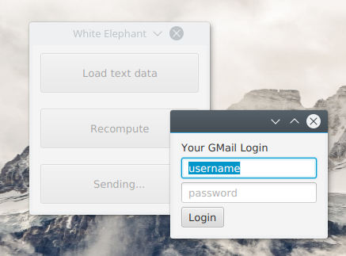

### Secret Santa Sender

Sends emails to everyone in a secret santa gift exchange.

Parses a data file in the format `groupid, name, email`.

```
# from example-data.txt

0, A person, aperson@email.com
0, B person, bperson@email.com

1, C 3rd person, cperson@email.com

2, D last member, dperson@email.com
```

Sends an email like: 

```
Subject: Secret Santa Gift Exchange

Hi!

start<sender's_gmail_username> has signed you up for a Secret Santa Gift exchange. 
You will be bringing a gift for... <name>. 

```


The program solves a possible route making sure nobody is giving a gift to 
someone in their group (if possible). For this example, A person gives to 
C 3rd person gives to B person gives to D last member gives to A person. 
Loop achieved. 

Uses your gmail login to send emails through smtp (SSL secured).




##### Todo

- Delete the sent messages from the senders profile
- Allow the user to customize the email template
